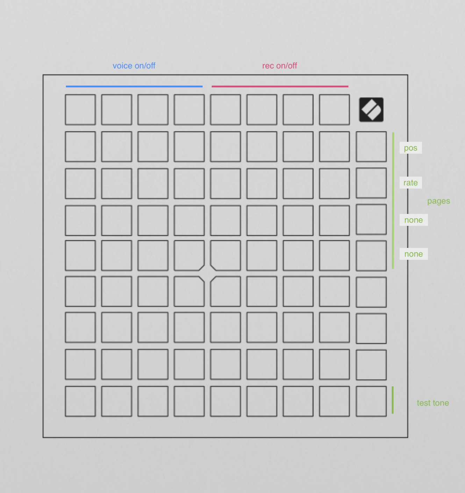

# twil
crossfeeding tape machines

in norns>devices
there are two launchpad's midi ports
select the sencond one

*set up*
>enter mode selection in launchpad (mini mk3 hold session / pro mk3 hold setup).
>choose 'programmer mode' (mini: stop / pro : print to clip).
>exit (mini: tap session / pro: tap setup)

*layout*

